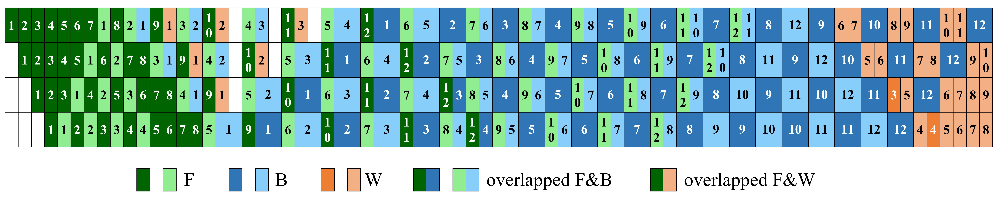
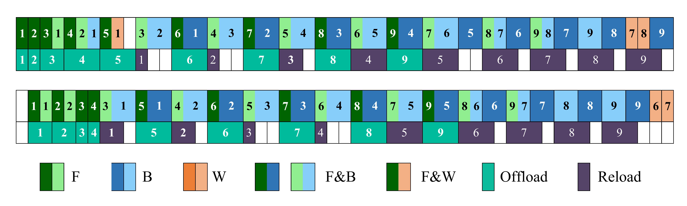

<div align="center" style="font-family: charter;">

<h1>Synergistic Tensor and Pipeline Parallelism</h1>

<br />

<a href="https://arxiv.org/abs/2510.27257" target="_blank">
    
</a>


<div>
  <a href="https://jueduilingdu.github.io/" target="_blank">Mengshi Qi</a><sup>1</sup>,
  Jiaxuan Peng<sup>1</sup>,
  Jie Zhang,
  Juan Zhu,
  Yong Li,
  Huadong Ma<sup>1</sup>
</div>

<div>
    <sup>1</sup>Beijing University of Posts and Telecommunications&emsp;
</div>


<p align="justify"><i>
In modern large-scale training systems, hybrid parallelism, combining tensor parallelism (TP) and pipeline parallelism (PP), has become the standard for scaling Large Language Models (LLMs) and Multimodal LLMs (MLLMs). Yet a fundamental tension remains: TP incurs heavy collective communication overheads, while PP introduces idle time through pipeline bubbles. We explore this challenge by rethinking the structure of forward and backward computation itself. Our approach decouples these passes into fine-grained units and braids them into a composite sequence, enabling near-complete hiding of TP communication. Built upon this foundation, we craft a synergistic PP schedule that further compresses pipeline bubbles.
</i></p>
</div>


## Schedule
### Motivation


The forward and backward computations (e.g., Attention and MLP) are interleaved for overlapping computation and All-Reduce communication in tensor parallelism, enabling efficient utilization of GPU resources and reducing idle time.

### Comparison of existing schedules


| Schedule     | PP Bubble                              | TP Bubble           | Peak Activation Memory     |
|--------------|----------------------------------------|---------------------|----------------------|
| 1F1B-I       | $(p-1)(T_F + T_{AR} + T_B + T_W)$      | $2mT_{AR}$          | $(3p - 2) M_a$       |
| ZB-V         | $(p-1)(T_F + 2T_{AR} + T_B - 2T_W)$    | $4mT_{AR}$          | $2p M_a$             |
| Ours         | $(p-1)(T_F + T_{AR} + T_B - T_W)$      | $(2p + 1)T_{AR}$    | $3p M_a$             |

| Symbol      | Description |
|-------------|-------------|
| $p$         | Number of pipeline parallel (PP) stages |
| $m$         | Number of microbatches ($p \ll m$) |
| $M_a$       | Activation memory per microbatch per model chunk |
| $T_F$       | Forward computation time per chunk |
| $T_B$       | Activation gradient computation time per chunk |
| $T_W$       | Weight gradient computation time per chunk |
| $T_{AR}$    | TP communication time per chunk |


We compare our synergistic schedule against two pipeline parallelism strategies: 1F1B-I and Zero Bubble V (ZB-V). While 1F1B-I suffers from large pipeline bubbles and ZB-V incurs excessive tensor parallel communication overhead due to its decoupled backward pass, our approach jointly reduces both PP and TP bubbles through fine-grained interleaving of computation and communication.

### Offloading Schedule


We introduce a CPU offloading strategy that overlaps tensor transfers with on-device computation. As illustrated in the schedule, activations are offloaded immediately after computation, reducing GPU memory pressure without stalling the training pipeline.

## Run this schedule
```python
from stp.trainer import Trainer

# ---------- initialize distribution --------- #
...

# ------------- initialize model ------------- #
model = ...

# ------------ initialize trainer ------------ #
trainer = Trainer(model, ...)

# -------------- training loop --------------- #
num_epochs = 10
for epoch in range(num_epochs):
    trainer.step()
```


## Citation
```
@misc{qi2025synergistictensorpipelineparallelism,
      title={Synergistic Tensor and Pipeline Parallelism}, 
      author={Mengshi Qi and Jiaxuan Peng and Jie Zhang and Juan Zhu and Yong Li and Huadong Ma},
      year={2025},
      eprint={2510.27257},
      archivePrefix={arXiv},
      primaryClass={cs.DC},
      url={https://arxiv.org/abs/2510.27257}, 
}
```